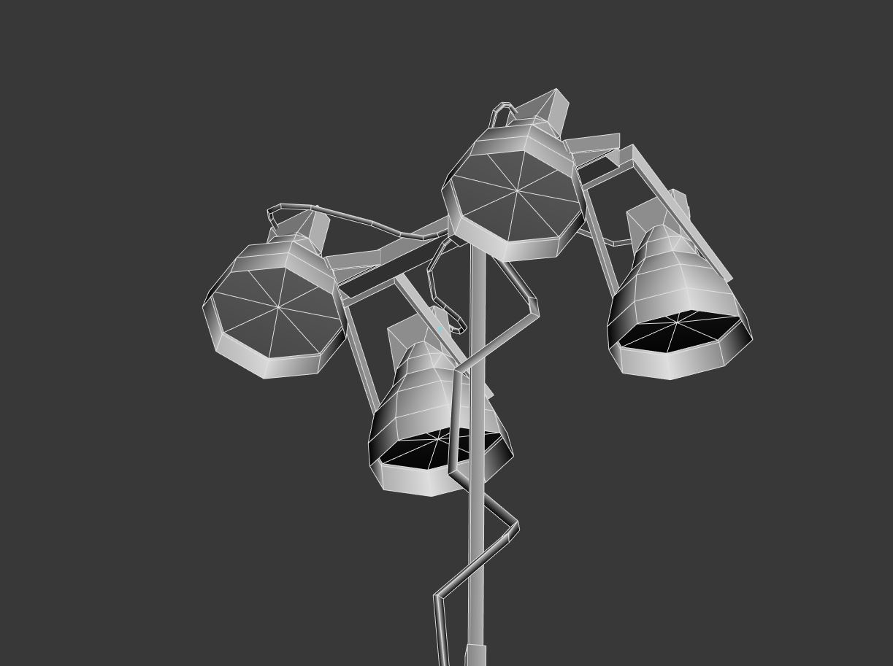
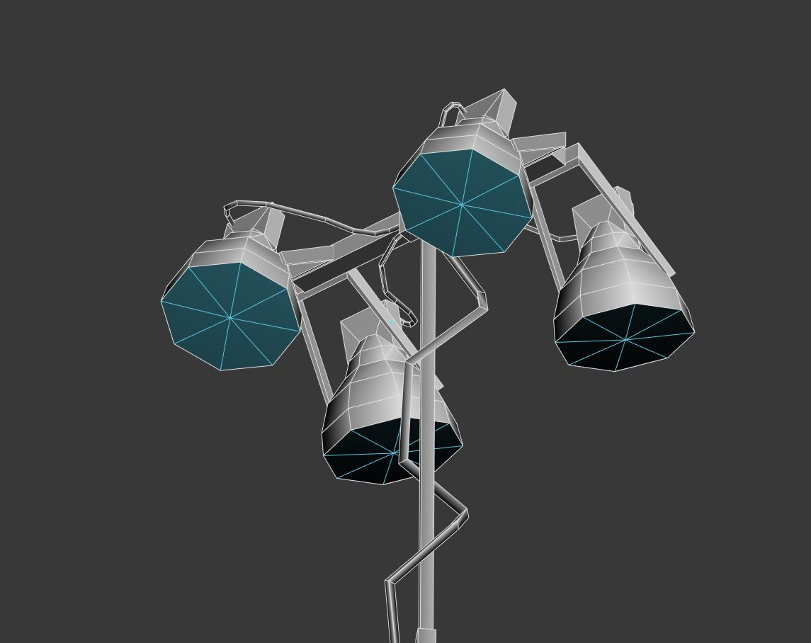
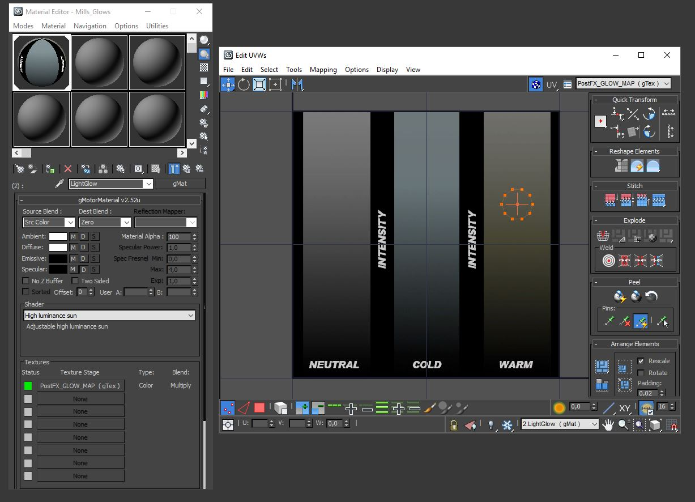
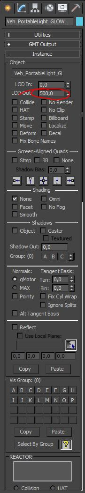
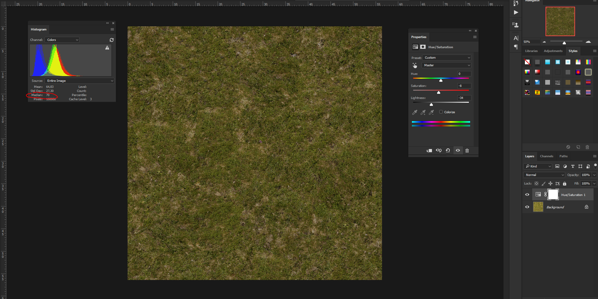

.. warning::

  This section contains old information which is partially or fully
  deprecated. Often you may still wish to refer back to these for one reason or
  another, but Studio-397 does not guarantee their accuracy with the latest builds.

.. sidebar:: Source

  Slightly modified copy of the original information from the official
  |Developer Guide by Studio-397|. Used with permission from Studio-397.

  .. |Developer Guide by Studio-397| raw:: html

     <a href="https://docs.studio-397.com/developers-guide" target="_blank">Developer Guide by Studio-397</a>

############################
Guidelines for Track Artists
############################

.. contents:: Contents
  :depth: 1
  :local:

***********
Albedo Maps
***********

**Albedo maps are now mandatory;** with the PostFX integration we are now forced
to balance our diffuse maps to work as albedo maps. You now also have a basic
Albedo chart that you can use to set your texture "|median|" levels.

.. |median| raw:: html

  <a href="https://helpx.adobe.com/photoshop/using/viewing-histograms-pixel-values.html" target="_blank">median</a>

************
Track Lights
************

Create a mesh, with the shape of the bulb reflector (can be even a flat cap),
and map it with the glow texture we provided in the sample, using the HighSunLum
shader. Export this as glow mesh so it will be loaded when headlights are ON.
Do Not Use any “fake” glow mesh or custom shader as we were doing in the past. 

It is VERY important to note that the size of the PostFX glow mesh has to be,
at least, as big as the tracklight reflector bell outer ring. Do not create
small mesh, unless you don’t want to simulate led lights, or specific shapes.
If you want solid and strong headlight effect just be sure to create glow disks
as big as your headlight reflector bells, on the outer and larger diameter.

*****************************************
Semaphores/Starting Lights/Caution Lights
*****************************************

Semaphores/Starting Lights/Caution Lights (all low intensity
bulbs) use shaders with 100% Emissive Color - Diffuse map for the
Light ON must be strong in terms of sat and brightness to engage the
bloom.

***********
Color Gamut
***********

Let’s limit the saturation and brightness of your albedo map, to average 85%, 
max 90 for pretty strong colors. Never use anything above that range. If you
have old textures you want to quick fix, you can try applying a Level layer
and dropping the OUT from 255 to 200.

***********
Normal Maps
***********

Normal maps are more data files than art, so they should be exported
non-compressed to avoid glitches in the spatial/color information. We will
give you all details about formats and schemes, once we moved to the engine
optimization tasks.

********
Textures
********

**Atlass textures as much as you can**. If you have many small texture with
similar material attributes, try to atlass them into a singular material,
averaging shader settings to a good compromise. This will improve performance
reducing overall drawcalls.

**Try to use real time texture formats as much as you can**; try to
limit the usage of TGAs to just system/target files, and use .dds/BC
for the entire main art. We will give you a complete set of optimized
DX11 texture format as soon as we move to the DX11 optimization task.

*******************
Track Light example
*******************

Track Light example mesh, without the postFX glow mesh.

Track Light example mesh, with the postFX glow mesh.

Track Light example mesh UV, shader settings, and mapping. In that
texture you can set different intensity and different color
temperatures. For a nice touch, just set your track omnilights RGB
colors, same as the texture area you pick on the texture.

Track Light example mesh, export settings (be sure your postFX glow
mesh has same LOD Out as the main TrackLight mesh, so they will pop
in the scene at the same time.

Track Light example SCN code (the Instance for the glow mesh must
have same suffix name as the first omnilight in the scene (in this
case NightLight01).

.. code-block::

      Light=NightLight01
      {
      Type=Omni Pos=(15.029381, 9.138912, -406.351288) Range=(0.000000, 40.000000) Active=True Intensity=(4.500000) Color=(255, 238, 193)
      }
      Instance=NightLight01Glow
      {
      MeshFile=YOURGLOWMESHNAME.gmt CollTarget=False HATTarget=False
      }

****************************************
Art & Shader Calibration Scene (picture)
****************************************

***********************************
Basic 3DsMax scene for Track Lights
***********************************

:download:`rF2_LightSample.zip<files/rF2_LightSample.zip>`
