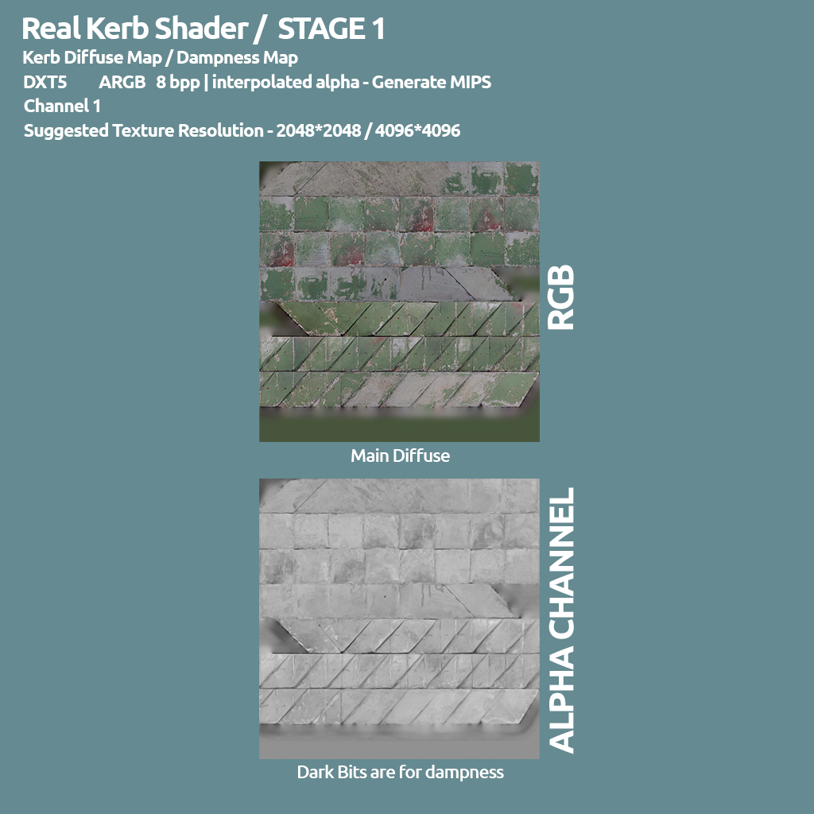
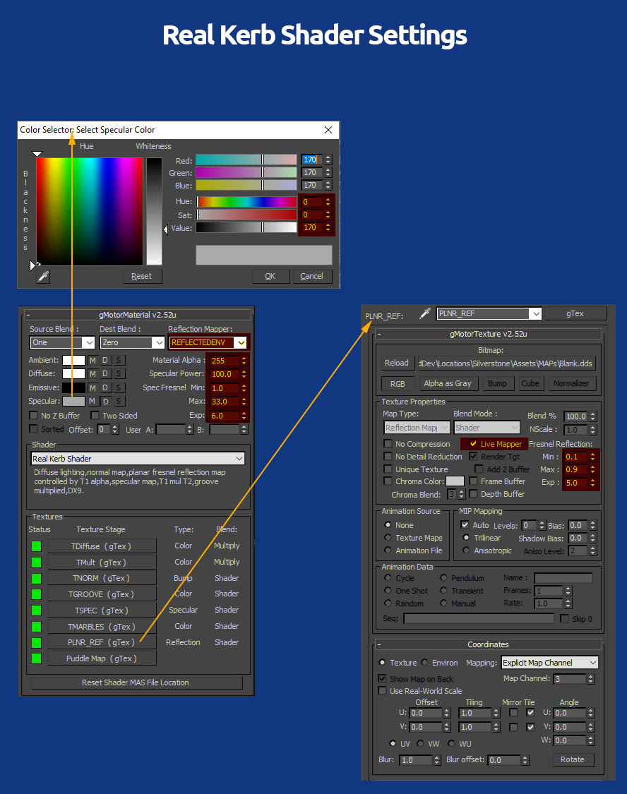

.. warning::

  This section contains old information which is partially or fully
  deprecated. Often you may still wish to refer back to these for one reason or
  another, but Studio-397 does not guarantee their accuracy with the latest builds.

.. sidebar:: Source

  Slightly modified copy of the original information from the official
  |Developer Guide by Studio-397|. Used with permission from Studio-397.

  .. |Developer Guide by Studio-397| raw:: html

     <a href="https://docs.studio-397.com/developers-guide" target="_blank">Developer Guide by Studio-397</a>

#####################################
Rain Effects on RealRoad and RealKerb
#####################################

*... Shaders for Tracks*

Goal of this guide is to help the artists in the process of implementing
Rain Effects for Tracks, from the art creation to the shader settings.

.. contents:: Contents
  :depth: 1
  :local:

************
Requirements
************

Software
========

-  3Ds Max 2012 with rFactor 2 latest Plugins  and Shaders
-  Photoshop CC 2018
-  Latest nVidia DDS Plugins, 64bit

Hardware
========

-  A Wacom Tablet and Pen
-  A PC/MAC with at least 8GB of RAM

Assets
======

-  Roads and Kerbs Puddle Maps needs to be mapped on UV 5
-  UVW template of the UV5 @ 16K Resolution (16384\*16384)

Final Puddle Map downsampled to 8K (or 4K for a very small track course)

****************************************
A brief introduction to the rain effects
****************************************

What is affecting the Road and Kerbs wet/dampness reflections?

-  The Groove on the asphalt, more rubber it will display more
   slippery/shiny look. This information is based on the RaceGroove
   alpha channel and the amount of rubber we have when it starts
   raining. This is a blurred reflection.
-  The High Frequency dampness, like crackles and overall wet randomness
   on the tarmac. This information is based on the Road/Kerb diffuse map
   alpha channel. This is also a blurred reflection.
-  The Puddles around the course, where we have standing water. This
   information is based on the Puddle Map, stored in the Specular map
   alpha channel. This is a mirror reflection, if the simulation is
   running ULTRA settings for that effect.
-  The Rain Drops Ripple Waves forming on the puddles/standing water.
   This is totally automated by the code, and it’s mapped on the UV
   channel of the detail maps.

How these effects are interacting with time and weather factors?

-  An algorithm does take into account the rain severity and the sun
   occlusion, and that factor does translate into the dampness and
   puddles formation speed and depth.
-  The puddles will be filled with water while raining, and they will
   dry out when it does stop raning. This is again happening
   dynamically, along the passing time.
-  When the rain stops, driving along the course will generate a dry
   line, depending on how many cars are lapping in the course, this
   process may be more or less quick.

************************************************
Step 1 - Setting Real Road and Real Kerb Shaders
************************************************

1.1 - The Real Road Shader composition
==========================================

.. image:: img/Stage7.png

1.2 - The Real Road Shader Settings
======================================

**It’s Important to respect these settings as much as possible**, to
achieve constancy between contents/art, and more important, to give the
Shader and RainFX code the numbers that they are expecting, and produce
the wanted output. Using different values/settings, might produce
unexpected results and also introduce performance issues.

**Main Real Road Material Settings**

-  Specular Color: Min 130.130.130, Max 200.200.200 (**Do Not Exceed
   200**, as this is the Albedo floor)
-  Specular Power: Min 5, Max 15
-  Specular Fresnel Min: ~0.01
-  Specular Fresnel Max: ~66.0
-  Specular Fresnel EXP: 5.3 (**Always** stay in the **5.0/5.5** range)
-  Reflection Mapper: REFLECTEDENV

**Planar Reflection Stage Settings for Real Road (**\ Stage 7)***\*

-  Live Mapper: Checked
-  Fresnel Reflection Min: 0.1 (Do Not Use Different)
-  Fresnel Reflection Max: 0.9 (Do Not Use Different)
-  Fresnel Reflection EXP: 5.0 (Do Not Use Different)

1.3 - The Real Kerb Shader composition
==========================================

1.4 - The Real Kerb Shader Settings
=======================================

**It’s Important to respect these settings as much as possible**, to
achieve constancy between contents/art, and more important, to give the
Shader and RainFX code the numbers that they are expecting, and produce
the wanted output. Using different values/settings, might produce
unexpected results and also introduce performance issues.

**Main Real Kerb Material Settings**

-  Specular Color: Min 130.130.130, Max 200.200.200 (**Do Not Exceed
   200**, as this is the Albedo floor)
-  Specular Power: Min 75, Max 115 (Low side for raw/worn painting, High
   side for fresh/clean painting)
-  Specular Fresnel Min: ~1.00
-  Specular Fresnel Max: ~33.0
-  Specular Fresnel EXP: 6.0 (**Always** stay in the **5.0/6.0** range)
-  Reflection Mapper: REFLECTEDENV

**Planar Reflection Stage Settings for Real Kerb (**\ Stage 7)***\*

-  Live Mapper: Checked
-  Fresnel Reflection Min: 0.1 (Do Not Use Different)
-  Fresnel Reflection Max: 0.9 (Do Not Use Different)
-  Fresnel Reflection EXP: 5.0 (Do Not Use Different)

*********************************
Step 2 - Mapping for Rain Puddles
*********************************

Mapping for the Rain puddles is pretty simple and straight. The
important task here is to be 100% sure you are mapping all the Real Road
and Real Kerb mesh, at the same time, so that you get a single mapping
for all of them.

Let’s see an example, showing how to proceed in general;

Isolate and select all your mesh that are using the Real Road and Real
Kerb shader;

Add an Edit Poly modifier to the stack, and go to poly or element mode,
then select all the polygons/elements;

Now add an Unrwap UVW modifier in the stack, and (IMPORTANT) set the UV
channel to 5. When you’ll be asked what to do with the current UV, click
on abandon (we **don’t** want to port CH1 to CH2);

.. image:: img/TrackRainFXPaint_3.JPG

Now, while in the Unrwap UVW modifier, go into Face mode and select all
faces. With all faces selected, press the Planar Map icon. This will map
the entire selection (all roads and all kerbs) to a planar map;

Press now on the Reset icon, to rest the planar mapping inside the
square 1:1 canvas;

You can now open the Editor (Open UV Editor button), to check the
mapping;

At this point, not mandatory, you can rotate and rescale the mapping to
optimize the available canvas. Sometimes it’s possible to get a bit more
pixel/meter resolution from that move, sometimes the stock Planar
mapping is good enough. Your call here.

.. image:: img/TrackRainFXPaint_8.JPG

Now we will export two maps, that we will use in our main puddle map
.PSD file.

First map we need is the UVW wireframe, with alpha channel, so that we
have a visual reference for the paint.

To do so, in the Edit UVW, go to Tools——→Render UVW Template;

We need very high resolution for these maps, since our PSD will be a
16384px\*16384px canvas. Since max 2012 has a capped resolution to
10000+10000, this is the res that we set the dialog box, we’ll be
resizing later to match our PSD canvas.

Set the dialog box as the picture, and Render the UVW template;

Set your file location, set .TIF as image format, and set the file to be
an 8bpp + alpha, as in the picture

Now that we have the wireframe template, we need a mask of the track, to
isolate our painting in the map.

To do so, just redo the above procedure, but this time using these
settings in the template dialog;

Time to save your new template file, same as before, set your file
location, TIF format, 8bpp, store alpha channel;

Now, before moving to Photoshop for the painting, **we need to export
all these selected mesh, to the track GMTs folder.**

Remember that the plugin does not allow to export any mesh into GMT, if
one of the textures does exceed the 4096\*4096 size. This is why it’s
better to export BEFORE resizing the Asphalt_SPEC texture, that does
host our PuddleMap, otherwise the plugin won’t export.

In the case you need to re-export, with that Asphalt_SPEC 8096\*8096 in
place, you can rename that texture and then you can use a dummy
1024\*1024 Asphalt_SPEC.dds that you can just for this operation.

**We now have the two reference maps, so we can exit 3Ds Max and launch
Photoshop CC**

Step 3 - Creating the PuddleMap in Photoshop
--------------------------------------------

I know that at this point you probably have a question; why working with
a 16384px\*16384px huge photoshop file, if the final texture will be
8192\*8192px?

Well, this is what we do suggest, since we are painting a map that does
represent the entire cuircuit, our pixel/meter ratio is pretty low end,
so painting on a 16K canvas, give us more brush and paint precision,
other than a good dynamic when working with a wacom pen, especially for
smaller events in the map. Again, this is what we suggest and what we do
internally, but you are free to work straight in a 8K canvas, if your
system isn’t that great managing big photoshop files, big chunks of RAM
and disk Cache.

Let’s start a new project, with the wanted resolution. In this case we
will go for our internal standards, creating a 16384px\*16384px canvas;

Now, this is also NOT mandatory operations for modders. This is how we
do internally, with our artists, since we think this is a good
streamlined process for the task.

We do create a layer group, called Puddle Map, and we do create two main
layers for the paint;

HF, where we’ll be painting the high frequency events, like deep small
puddles, and everything we want to be filled with standing water. We do
set this layer opacity to 80/100%.

LF, where we’ll be paiting major depression, with a faint intensity.
This is where we put, for example, the extra thick dampness that does
build up around the puddles. We do set this layer opacity to 30/45%

Let’s save the document as PSD;

Now let’s open both templates we exported from 3Ds Max, for the wire UVW
and the track mask. After that, we’ll be upscaling both to our actual
PuddleMap canvas resolution, as in this picture;

Let’s do the same for the UVW template;

Now that we have the two template of the same size as the Puddle file,
we need to copy/paste the alpha channels from both 3Ds Max templates,
into the puddle map file. At that point those two templates are not
needed anymore and they can be closed.

In this pictures, we dropped the UVW template alpha into our main Puddle
PSD, this will give it the name of Alpha 1. Same with the Mask template,
we dropped its alpha channel in the main Puddle PSD, and this layer have
been named Alpha 2.

Let’s save our PuddleMap.PSD before to proceed.

Now, our task is to use the mask alpha, to mask the Layer group we did
before, so that what we will paint, will be automatcally masked. This is
mostly to give you a clean output, so you don’t get lost after couple of
minutes of painting.

To do so, we can just go Channels, select the Alpha 2 (which is the Mask
we need), and click in the small Selection icon, at the bottom of the
Channels panel. You can do the same operation just clicking on the Alpha
layer, while pressing the CTRL key;

Now that we have the mask selection loaded, we just select the Puddle
Map Layer Group, and we do apply the mask, clicking on the small Mask
icon at the bottom of the Layer panel.

We also need a Base layer at the bottom of that Layer Group, filled with
100% white, to be used as base for our Puddle Map. This is what you
should get;

Now we need the UVW template reference, and to create one we can just go
in the Channels panel, select the Alpha 1 (which is our UVW template
from 3Ds Max), and create a selection, through the small button at the
bottom of the panel, or just clicking on the Alpha layer while pressing
the CTRL key;

Now, again, let’s go back to the Layers panel, create a new layer on top
of the stack (call it UVW), and Fill it with Black color. This will
produce our UVW wireframe reference layer;

.. image:: img/PSD_PuddlePaint_9.JPG

Now we have everything in place, and our PuddleMap.PSD is ready for the
paint job;

The PuddleMap, if possible, should be based on reference materials from
the real place, and possibly that have been recorded in the same years
that our Sim Track is representing.

For this specific case, Mores 2012 in Sardinia, we’ve used many wet
onboard videos recorded in between 2012 and 2014, to be used as visual
reference to map our PuddleMap.

Always remember that there is always a random/chaos factor when it comes
to dampness, as there are so many variables playing in that area, that
mean you don’t have to go nuts to achieve extreme accuracy in the
painting, especially in the low frequency side. Just do your best to
make it looking as much similar as the real one, in similar conditions.

This is the HF layer, with all the puddle maps, and every place where we
want standing water. You recognize these are using the darker ink in the
scale. More darker means more depth in the dip/hole so use that ink
where we want standing water building up.

This is the LF layer, with high dampness patches;

And, in this specific case for Mores, we have added and extra layer to
give those low drainage patches, more dampness than the rest of the
tarmac;

This is all layers composed together;

And this is the final composition, ready to be downscaled, and pasted in
the Asphalt_Spec.dds DXT5 texture.

Don’t be scared by the look of it. This is the extreme condition (storm)
of a very worn out road surface, as Mores had (and still have), at the
time of the survey. The RainFX code and Shaders, will build up dampness
and fill up the puddles, along the time, and depending on the rain
severity. The puddle map does represent the dips and other ground
depressions, completely filled of water. BTW, you may have much less
puddles and patches, in a more clean tarmac track. Every track, tells a
different story.

Final steps now.

Select all and Copy Merged (this way you are copying the visible status,
not the single selected layer);

Now create a new document, with the same size as the Clipboard;

Now paste in place the clipboard, so that you’ll drop the composed
puddle map into the stack;

Now we are pretty much ready for the 16K–→8K downsample. Be sure to use
the Bicubic Sharper resample method for the riduction;

Now, as before, select all and Copy. Be sure you have the puddle map
layer selected;

Now you have the puddle map in the memory clipboard.

Open your track Asphalt_SPEC texture, BE SURE IT IS ALREADY
8192px\*8192px. If it’s smaller, or bigger, be sure to resize to
8192\*8192 before to proceed;

Now, go to the Channels panel, select the Alpha layer (if not present,
create one), and paste in place. This will drop your clipboard inside
the Alpha Channel.

Your Asphalt_SPEC is now ready to be exported as .DDS;

Last step, be sure to save as 2D Texture, DXT5 - ARGB 8bpp -
Interpolated Alpha, generating MIP maps.

Save in your MAPs folder and wait for the export. Considering the size
of the texture, the process could take quite a while to complete, just
the time for a coffe!

**Congratulation! Your Puddle Map is done!** 

*******************************************************
ADDENDUM - New parameters to control Planar Reflections
*******************************************************

As part of the improvements we did for the RainFX and Road/Kerb shaders,
we also unlocked more controls for the planar reflections, to make them
looking better, reducing clipping.

This is the typical Reflectedenv section, that you can find in our
tracks:

.. code-block::

   ReflectionMapper=REFLECTEDENV
   {
     Type=Planar
     TextureSize=(1024)
     UpdateRate=(100.000)
     StaticSwitch=(250.000)
     TrackingIns=NULL

Now we have two extra controls;

.. code-block::

   ReflectionMapper=REFLECTEDENV
   {
     Type=Planar
     TextureSize=(1024)
     UpdateRate=(100.000)
     StaticSwitch=(250.000)
     FarPlane=(2000.00)
     MaxElementsCap=(64)
     TrackingIns=NULL

**FarPlane distance** is setting the linear distance between the
“reflection cam” and the far plane projection. Usually bigger the
track, longer is that number. Just find the shorter distance that
allow you to not get any clipping in the reflections for the very far
objects.

**MaxElementsCap** is setting the maximum amount of objects that can be
reflected at the same time. The coded value is for 64 objects, even if
you don’t have this line in the Reflectedenv syntax. We do not suggest
to go too far from that number, as it has an impact on frame render
time, but if you are in a situation where you need to reflect more than
64 objects, then now you can.
