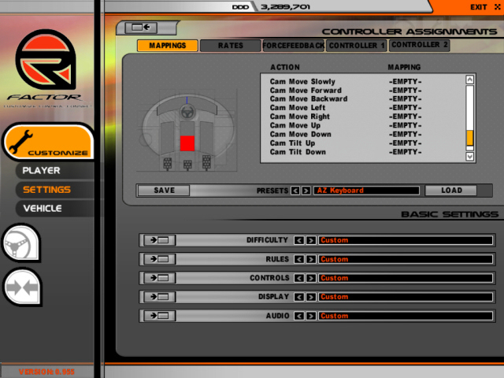

*******
Cameras
*******

Spectator Camera
================

The Spectator Camera is a new camera mapped to the END key that allows
the player to freely move about the track. When END is initially pushed
the closest tracking camera to the car is activated. Each consecutive
END button press gets the next tracking cam. If another camera is
activated, the next time the Spectator Camera is entered, the closest
tracking camera to the car is activated again. When Spectator Cam is
activated FreeMove is automatically turned on and when another camera is
activated FreeMove is forced off. Based on how many times END was hit
before another camera was entered, the closest camera or the next camera
will be retrieved. To make it easy for the player to move around in a
trackside camera the spline are not active when spectator cam is being
used.

Swingman Camera
===============

The swingman camera originally used hard coded speeds for relative yaw,
pitch, roll, and radius adjustment. These speeds are now read from the
camera configuration file. Furthermore, independent acceleration and
deceleration values are also read in for yaw, pitch, roll, and radius.
In order to implement the deceleration, it was necessary to check each
frame to see if the swingman keys were NOT being pressed. If this is the
case, and the camera is currently moving, the deceleration factor is
subtracted from the current speed. A small feature was added to slightly
roll the camera when the relative yaw is adjusted. This seemed like a
fun thing to do, however it can cause slight nausea. This function takes
an angle to roll to. It doesn't immediately roll to the angle, but
instead gradually rolls until it gets to the target angle.

FreeMove
========

FreeMove is an extension of FreeLook. Any camera can now be moved around
by the player. The control is similar to the controls of a FPS game. The
user can map keys to control forward, backward, strafe left, strafe
right, up, and down. The movement of the camera is relative to the
orientation of the camera. If the forward key is pressed, the camera
will move forward along the orientation vector of the camera. The
movement of the camera is an offset from where the camera would
regularly be. If the current camera is an attached camera, the camera
will continue to follow the vehicle as usual, with the FreeMove offset
added to this. If the camera is a tracking camera following a spline,
the camera will continue to follow this curve and the FreeMove offset
will be added to this. In addition, FreeLook's key mappings were
reworked. All orientation changes are able to be mapped to the keyboard.

Control - Toggle Free Look

Control - Zero Free Look

Control - Camera Slow Move

Control - Camera Move Forward

Control - Camera Move Backward

Control - Camera Move Left

Control - Camera Move Right

Control - Camera Move Up

Control - Camera Move Down

Control - Camera Tilt Up

Control - Camera Tilt Down

Control - Camera Tilt Left

Control - Camera Tilt Right

Control - Camera Turn Left

Control - Camera Turn Right

Control - Camera Zoom In

Control - Camera Zoom Out

Vehicle Specific Cameras
========================

This feature allows for separate camera configuration files for each
vehicle. To specify a camera file to use, a line can be added to the
vehicle's vehicle_name.veh file in the form: Cameras=camera_file.cam. If
this line is not present, the file \\GameData\\Vehicles\\default.cam is
used. The camera data is then stored in the vehicles VehData data
structure. When the user switches vehicles, these cameras are copied
into the AttachedCameraManager and used thereafter. There is one problem
with this implementation that was just discovered. If the user creates
an onboard camera in the camera editor, the new camera is saved in a
camera configuration file in the directory of the player file. These
cameras are then loaded when the game is started; however these cameras
are then overwritten by the vehicle's specific cameras.

TrackIR Device
==============

The TrackIR device was originally setup to use the CC_Look controls.
This was changed to use the CC_Camera controls instead. The TrackIR must
be mapped to some analog controls. Failure to do so will result in the
TrackIR acting like a boolean. When you move your head to the left for
example, it will act like the CC_LookLeft button and move all the way
over or nothing at all. Ensuring that the device is mapped to analog
controls will result in precise movements on screen relative to your
head position. Some other things added were checks for all sorts of
problems involving the TrackIR and its software or lack thereof. Also
the device will now center upon enabling of the hardware plugins.

Mirrors
=======

The mirrors are now able to be adjusted by holding the left shift button
and pressing the AdjustSeat\* controls. New variables in the player file
will result in the player's mirror position preference being saved each
time. The mirror eyepoint utilizes these variables in its equation when
trying to figure out what is to be displayed on the mirror. The mirrors
and seat will also play a sound when adjusting them. This is made
possible by changing the CC_AdjustSeat\* controls from KEYREP_REPEAT to
KEYREP_HOLD. This will allow the sounds to play continuously instead of
starting over each time the key repeats itself. The seat movement was
then slowed down to take in account this change. It moves approximately
the same as it use to. The sounds will stop when you have reached the
maximum/minimum position that the mirror/seat can move in. A few lines
must be added to each vehicle's \*.sfx file in order to play these new
sounds. Currently, the game renders the rearview mirror and that image
is split in half and each half is placed on the appropriate side mirror.
Adjusting the rearview mirror will result in the side mirrors being
adjusted as well. The only solution to this would be to render three
different views (one for each mirror). The benefit of this does not
outweigh the cost of the possible loss in FPS.
