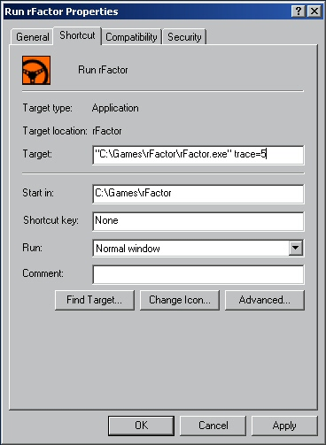

###
FAQ
###

.. warning:: These FAQ are over 15 years old, so understand them as
	informative only.

**Q:** How do I open MAS files?

**A:** With these new rFactor MAS Tools

**Q:** How do I open and edit \*.GMT files?

**A:** You can open GMT files in ZModeler2 with this ZModeler2 Filter.
Of course, you will need ZModeler 2. You can find ZModeler 2 right here.

**Q:** The game begins loading the track and then I get a CTD (crash to
desktop), how can I work out what's causing it?

**A:** The first thing to do is right click your rFactor shortcut, select
properties then add trace=5 to the target link of your shortcut.
The target line should then look something like this,
"C:\\Games\\rFactor\\rFactor.exe" trace=5
Important things to note are that the added text must be in lowercase
and after the quotation marks.

Your shortcut properties should look something like this;

After changing your shortcut, rF will create a trace.txt file in your
rFacor\\LOG folder each time you start the game (Note, trace files are
overwritten on every startup). You should then look here for errors such
as error loading file. This should help you to determine why the problem
has occurred and help to recify the problem.

If you are still having problems, try visiting one of these forums High Gear,
or RSC Forum. They are great communities and are always willing to help.
There is also a chance someone else has had the same problem, so it's
usually a good idea to try search for similar problems before posting a
new thread. If you are still unable to solve your problem, please create
a new thread and be sure to attach your trace.txt and other relevant details.

**Q:** I have a fast computer, well above minimum requirement, and yet my
frame rates are poor. What could be causing this?

**A:** First switch off anti-aliasing, and turn down your graphics, if you
still feel your frame rate is below what you should be getting with your
hardware there could be numerous possible causes. Is the problem completely
game specific? ISI based games are particularly sensitive in their need for
fast writes from your graphic card, there are many diagnostic tools available
out there. Such as FreshDiagnose, and Everest. If you find you have sideband
addressing enabled, fast writes enabled, and nothing seems out of the ordinary
and you are nearly 100% sure it's game specific, then you would do best
seeking help on one of the community forums.

If you have a VIA chipset and Fastwrites is not enabled, please try installing
some newer 4-in-1 drivers. If these do not help make sure you download the
very latest 4-in-1 drivers, extract these files using WinRar or a similar
program. Under Windows XP make your way to the device manager, expand the
System devices branch, then look for and select something like VIA CPU to
AGP Controller, right click and select update driver. Select install from a
specific location. Select 'Don't search. I will choose the driver to install.',
click next, have disk, look for the directory you have just decompressed the
files to, then go further into the folders
..\\viaagp\\DRIVER\\WinXP\\VIAAGP1.INF.
Click open, ok, then next. You will probably have to restart your computer.

**Q:** When I drive the car I can not exceed 78km/h, what's going on?

**A:** The answer is simple, you need to deactivate your pit lane speed limiter.
Go into controls and look for RPM limiter, check or assign a button to it,
and use this button after leaving the pits.
