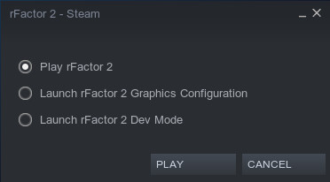

.. warning::

  This page is WIP.

.. _rfactor2-developer-mode-desc:

.. sidebar:: Source

  Developer Mode information and instructions were derived from the official
  Dev Guide from S397 (`Source <https://docs.studio-397.com/developers-guide/development-tools/developer-mode>`_, last retrieved on 06MAY2022).

##############
Developer Mode
##############

The Developer Mode (hereinafter referred to as "Dev Mode" or "DevMode") is a
standalone version of rFactor2 that is used in the development of game
contents such as vehicles or tracks.

The Dev Mode ships with a single location and vehicle by default, is less
restricted on how files must be packed, and allows some options that are not
available in the main game. This allows easier development of contents.

.. note:: Player files in the Dev Mode are not shared with the main game, so
  you will need to configure your settings independently.

********
Starting
********

Starting from Steam
===================

When starting rFactor 2 from your Steam Library, a little menu will pop up and
give you the option to either start the main game directly, start the graphics
configuration tool, or start the Developer Mode:

Select "Launch rFactor 2 Dev Mode" and left click on "PLAY" to start the
Dev Mode.

.. _startfromshortcut:

Starting via Shortcut
=====================

Alternatively to the aforementioned, you can also create a desktop shortcut
to start the Dev Mode without Steam (Windows only). To do so, set
"Target Path" of the shortcut to:

    ``"[YOUR PATH TO STEAM LIBRARY]\\Steam\\steamapps\\common\\rFactor 2
    \\Bin64\\rFactor2 Mod Mode.exe"``

And set "Start In" to:

    ``"[YOUR PATH TO STEAM LIBRARY]\\Steam\\steamapps\\common\\rFactor 2\\"``

To launch the graphics configuration for Dev Mode, you need to create a
second shortcut with "Targe Path" set to:

    ``"[YOUR PATH TO STEAM LIBRARY]\\Steam\\steamapps\\common\\rFactor 2
    \\Bin32\\rF Config.exe"``

And "Start In" set to:

    ``"[YOUR PATH TO STEAM LIBRARY]\\Steam\\steamapps\\common\\rFactor 2\\
    Devmode\\Userdata"``

.. note::	Replace ``[YOUR PATH TO STEAM LIBRARY]`` with the path of where your
  Steam Library is installed.

*******
Content
*******

Content for this version of the game maybe copied directly from the folder
where you have originated content into the appropriate location or vehicles
folders (if you are not working directly in these folders).

    ``steamapps\\common\\rFactor 2\\ModDev\\Locations``

    ``steamapps\\common\\rFactor 2\\ModDev\\Vehicles``

********
Controls
********

In mod mode there are all kinds of special key mappings for specific purposes.
This page tries to list them all:

.. table::
  :widths: grid

  +-------------------------------------+-------------------------------------------------------------------+
  | Key Combination                     | Description                                                       |
  +=====================================+===================================================================+
  | ALT+M                               | Disable mip LOD bias                                              |
  +-------------------------------------+-------------------------------------------------------------------+
  | ALT+R                               | Reflections debug window on/off  Shift+T and T scrolls between    |
  |                                     |                                                                   |
  |                                     | reflectors                                                        |
  +-------------------------------------+-------------------------------------------------------------------+
  | ALT+T                               | Switch between TGM and TBC tyre models                            |
  +-------------------------------------+-------------------------------------------------------------------+
  | CTRL+\\                             | Shows menu for RCD file creation                                  |
  +-------------------------------------+-------------------------------------------------------------------+
  | CTRL+5                              | Change trace file level                                           |
  +-------------------------------------+-------------------------------------------------------------------+
  | CTRL+C                              | Show cpu time for physics, gpu usage and histogram                |
  +-------------------------------------+-------------------------------------------------------------------+
  | CTRL+D, CTRL+K, CTRL+J              | Shows various data, mostly physics related.                       |
  |                                     |                                                                   |
  |                                     | Open with CTRL+D, and then switch alternative sets of data        |
  |                                     |                                                                   |
  |                                     | using CTRL+K and CTRL+J, as per description on screens            |
  +-------------------------------------+-------------------------------------------------------------------+
  | CTRL+F                              | Detailed cpu and memory usage                                     |
  +-------------------------------------+-------------------------------------------------------------------+
  | CTRL+G                              | Slow motion                                                       |
  +-------------------------------------+-------------------------------------------------------------------+
  | CTRL+H                              | Shows collision meshes                                            |
  +-------------------------------------+-------------------------------------------------------------------+
  | CTRL+I                              | AI uses player physics, with some aids enabled                    |
  +-------------------------------------+-------------------------------------------------------------------+
  | CTRL+Shift+Arrow Keys               | Move car, rotate car.                                             |
  |                                     |                                                                   |
  | CTRL+Shift+PageUp/Down              |                                                                   |
  +-------------------------------------+-------------------------------------------------------------------+
  | CTRL+T                              | Sound tuning                                                      |
  +-------------------------------------+-------------------------------------------------------------------+
  | CTRL+U                              | Displays various physics related data: draws suspension           |
  |                                     |                                                                   |
  |                                     | parts, tyre slip  curves etc.                                     |
  +                                     +-------------------------------------------------------------------+
  |                                     | 1st page, displays undertray points (orange crosshairs).          |
  |                                     |                                                                   |
  |                                     | Vehicle CG (body and total CG) in blue lines. Fuel tank           |
  |                                     |                                                                   |
  |                                     | CG location (grey and yellow crosshairs).                         |
  |                                     |                                                                   |
  |                                     | Suspension arms (red lines). Pushrod and reference arms (yellow). |
  |                                     |                                                                   |
  |                                     | Primitive sub-body representations (purple boxes).                |
  +                                     +-------------------------------------------------------------------+
  |                                     | 2nd page disables 3d vehicle graphics to show these locations     |
  |                                     |                                                                   |
  |                                     | more clearly.                                                     |
  +                                     +-------------------------------------------------------------------+
  |                                     | 3rd page TBC tyre editing table, for load sensitivity.            |
  |                                     |                                                                   |
  |                                     | Which used to be  more useful for rF1.                            |
  +                                     +-------------------------------------------------------------------+
  |                                     | 4th page TBC slip curve shape editor.                             |
  +                                     +-------------------------------------------------------------------+
  |                                     | 5th page Engine torque / power curve graph, showing the current   |
  |                                     |                                                                   |
  |                                     | available torque / power from the engine in current mapping and   |
  |                                     |                                                                   |
  |                                     | turbo boost pressure.                                             |
  +-------------------------------------+-------------------------------------------------------------------+
  | CTRL+V                              | Force feedback tuning display                                     |
  +-------------------------------------+-------------------------------------------------------------------+
  | CTRL+Z                              | Visualize drafting aero                                           |
  +-------------------------------------+-------------------------------------------------------------------+
  | SHIFT+I                             | Drive with AI physics (first go to CTRL+I)                        |
  +-------------------------------------+-------------------------------------------------------------------+
  | SHIFT+W                             | Tyre Wear display (basically pointless)                           |
  +-------------------------------------+-------------------------------------------------------------------+

*********
TweakBars
*********

The Dev Mode has various tweak bars accessible. These allow the adjustment of
various settings in real time that are not allowed normally. Including
environment, postfx, weather and more.

*******
Editors
*******

The Dev Mode includes the following additional "sub-editors" with which various
features of the vehicle or location can be edited:

AIW Editor
==========

The AIW (Artificial Intelligence Waypoint) Editor allows the editing of the - as
the name already indicates - waypoints the AI vehicles will be using on the track.
Waypoints hugely affects the driving experience when driving against AI
opponents in either offline (player against AI) or mixed (AI and real player)
online races.

Further information on the usage and features of the AIW Editor is included
in the respective AI Waypoints sub-sections of the Location Modding section of
this manual.

Camera Editor
=============

The Camera Editor allows the editing of vehicle and track cameras.

Further information on the usage and features of the Camera Editor is included
in the respective graphics sub-sections of the Vehicle Modding and Location
Modding sections of this manual.

HUD Editor
==========

The HUD (Heads-Up Display) Editor allows the editing of gizmos displayed on
screen while driving. These gizmos provide information about the vehicles speed,
location, timing, setup and other important data to the driver.

.. note:: Further details on the HUD Editor will be added to this section later.
