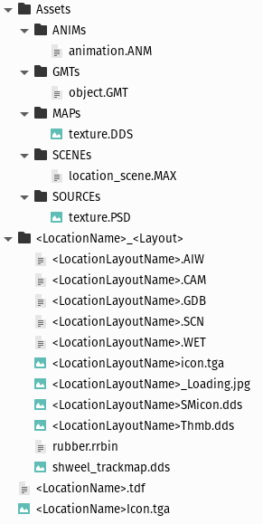

.. warning::

  This page is WIP.

.. _location-structure:

##################
Location Structure
##################

This page sets out a very high level overview of what is in a location. More
in-depth explanations of files can be found on the sub pages.

    Camera File (CAM)
    Game Database File (GDB)
    Real Road Files (RRBIN)
    Scene File (SCN)
    Terrain Data File (TDF)
    Weather File (WET)

*****************************
Developer Mode Install Folder
*****************************

Locations are installed into the following directory: steamapps\\common\\rFactor
2\\ModDev\\Locations

Location Folder Structure
=========================

A location follows a standard format. The beneath structure is as locations are
read when being used in ModDev, inside the Locations base folder.

Each overall location is stored with in a single folder. Multiple sub layouts
can be saved with in that folder. Each layout must have a unique name.

  Location Structure Tree

.. note::

  <LocationName> & <Layout> & <LocationLayoutName> are placeholders and shall
  illustrate that you should keep a strict naming convention to ensure the
  track will be properly loaded and displayed in the game.

Contents of the Assets Folder
-----------------------------

ANIMs
    ANM Animation files are stored here, these are typically exported from
    3ds Max via plugins.

GMTs
    GMT Mesh files are stored here, these are typically exported from 3ds Max
    via plugins.

MAPs
    Texture maps are stored here, they should be in DDS file format.

SCENEs
    3DS Max Files are stored here. Sub folders can be created for TSOs or
    Profiles.

SOURCEs
    Source files such as PSDs, Substance files, Vector files etc.

Contents of the Location Layout Folder
--------------------------------------

<LocationName>_<Layout>
    There is one folder for each layout of the track, which contains the
    various files to define each layout. It may also contain loose GMT and MAP
    files specific for this layout.

<LocationLayoutName>.AIW
    This AI Waypoint file contains text AI definitions for the layout.

<LocationLayoutName>.CAM
    This Camera file contains text Track side camera definitions.

<LocationLayoutName>.GDB
    This Game Database file contains a text database of generic meta data about
    the location layout.

<LocationLayoutName>.SCN
    This Scene file contains a text list of all the objects to be rendered in
    the scene as well as information about where to find those files and various
    other definitions.

<LocationLayoutName>.WET
    This Wet Weather file contains text definitions of how scripted weather and
    the environment in general should behave.

\*.rrbin
    These are real road definition files, generated from in ModDev mode. These
    provide a base line of rubber that can be loaded when setting up a session.

<LocationLayoutName>_Loading.jpg
    This is the loading screen at resolution 1920x1080.

<LocationLayoutName>icon.tga
    This is an icon file for the layout at resolution 102x87.

<LocationLayoutName>SMicon.dds
    An alternative icon at resolution 512x512.

<LocationLayoutName>Thmb.dds
    Another alternative icon at resolution 190x128.

shweel_trackmap.dds
    A texture which shows the track map on the cars steering wheel. Resolution
    128x256.

Lose Files in the Location Folder
---------------------------------

<LocationName>.tdf
    This Terrain Data File is a text based definition of how different surfaces
    should react, whether they be driven or collidable. This file is referenced
    via each layouts GDB file.

<LocationName>Icon.tga
    This is an icon for the overall group of locations.

The above structure then packs each folders contents into a MAS file and usually
encrypted. This is our own propriety format for archiving up files. A location
is distributed for the main game as a rFCMP file. The game launcher will
install this into the main install as a series of MAS files along with an MFT
meta data file which just very basically describes the version of the content
and includes checksum verification for the MAS files.

GMT Files
---------

Files of GMT format are our export of meshes. These are exported directly from
3ds Max via plugins.

AI Waypoint File (AIW)
----------------------

The AI Waypoint file is generated using the AI Editor which is included with in
the ModDev mode.

Camera File (CAM)
-----------------

The Camera file can be generated using a specific mode in ModDev. It can also be
done by hand or using 3rd party applications.

Game Database File (GDB)
------------------------

The GDB file contains the unique identifier for the layout on the first line,
and then a series of properties are defined, including the name of the layout,
and various other meta information such as location, length, latitude,
longitude, race date etc.

Scene File (SCN)
----------------

The SCN File contains information about the scene in general. It starts of with
all the paths to search for files and any MAS file which should also be
searched. The View and some basic settings such as shadow range and basic
fog settings. It also contains all light, object and reflection mapper
definitions. It is possible to export this data directly from 3ds Max, but
it is often easiest to just export snippets of information and manually edit
these in.

Wet File (WET)
--------------

Wet files allow us to preconfigured scripted environmental conditions. From
how the road grips up from session to session by default and also how the
weather changes over time during sessions too.

Commonmaps.MAS
--------------

Inside the locations folder is a commonmaps.mas file. This contains various
basic maps which are shared with all locations usually (it still has to be
specified in the SCN file).
