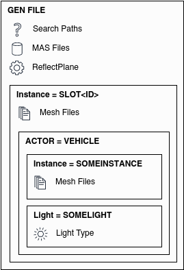

.. warning::

  This page is WIP.

.. sidebar:: Source

  Source of the information and descriptions herein were extracted from
  "skipbarber.gen" and "skipbarber_spinner.gen" files of the SkipBarber that
  comes with the Dev Mode of rFactor2 game version v1121. Where necessary and
  available, information and descriptions were amended.

##################
Vehicle Generation
##################

.. contents:: Contents
  :depth: 2
  :local:

************
Introduction
************

Of course, the vehicle that is to be rendered in the game needs to be generated
somehow and this is achieved through scripting in so-called GEN files. These files
basically tell the game where to retrieve mesh files and textures from, how or if
and when they are rendered (Levels Of Detail (LOD)). But they are also used to
define any visual upgrade parts (changeable through upgrades) and any head, brake,
or pit/rain lights available for a vehicle.

Typically, there are two different GEN files: One GEN file the in-game or track
rendering and a second file for the showroom or spinner rendering of a vehicle.
This page is structured according to that principle, with the first sub-section
explaining the scripting in GEN files for the in-game generation of a vehicle and
the second sub-section will explain the scripting in GEN files for the showroom or
spinner generation of a vehicle.

All information included in this page, except tokens, were copied from the source
files directly and amended or formatted as needed.

**********************
Structure of GEN Files
**********************

Search Paths, MAS Files, ReflectPlane, Main Instance, Actor, Sub-Instances

*******************************
In-Game Generation of a Vehicle
*******************************

The GEN file used for the generation of a vehicle in-game is usually having a simple
name, like the name of the vehicle itself. It does not have a file name extension to
not confuse with the GEN file used for generating the vehicle in the showroom.
This GEN file is referenced to by one or more VEH files.

.. _vehicle-generation-ingame-tokens:

Tokens for In-Game
==================

The available tokens for the in-game vehicle generation are:

.. note:: Tokens have the format ``<value>``.

ID
  This is replaced by the proper slot identification (000, 001, etc.), or

1,2,3,etc
  This is replaced by the first 1,2,3 characters of the vehicle GenString

VEHDIR
  This is replaced with the proper vehicles directory (e.g. E:\Data\season01\vehicles)

TEAMDIR
  This is replaced with the proper team directory (e.g. season01\vehicles\williams)

SPIN
  For the vehicle spinner in the options only

NOTSPIN
  For everything EXCEPT the vehicle spinner

LOW
  Low detail only

MED
  Medium detail only

HIGH
  High detail only

MAX
  Maximum detail only

DASHLOW
  Low detail dash

DASHHIGH
  High detail dash

STARTUPGRADES
  These token starts the section of where mesh instances can be replaced through
  upgrade parts.

STOPUPGRADES
  These token ends the section of where mesh instances can be replaced through
  upgrade parts.

Example: For slot #2 using the vehicle file "nicecar.VEH", the line

``Instance=SLOT<ID>  MeshFile=<123>gva.GMT``

would be replaced with

``"Instance=SLOT002   MeshFile=nicgva.GMT"``

Search Paths
============

The search paths tells the game where to retrieve the model files and textures
from to build an instance of a vehicle.

.. note:: Please note that the game always uses the last file it can find. So in
  case you have multiple files with the same name present in either the Search
  Paths or a MAS File, the game will always use the last one. Especially when using
  the Dev Mode, this can be a source of error.

SearchPath
  Example value:  <VEHDIR>

  The value can either be a token or a folder name or a combination of both.
  Paths are separated with a backslash ``\``.

Search Path Example
-------------------

.. code-block::

  SearchPath=<VEHDIR>
  SearchPath=SkipBarber
  SearchPath=<VEHDIR>SkipBarber\maps
  SearchPath=SkipBarber\maps

Mas Files Reference
===================

The MAS files references tells the game from which packed files to retrieve the
model files and textures from to build an instance of a vehicle.

MASFile
  Example value:  SkipBarber\\skipbarber.mas

  Example value:  cmaps.mas

  The value can either be a token, a folder name, a file name, or a combination
  of all. The file extension ``.mas`` should be included.

MAS File Example
----------------

.. code-block::

  MASFile=SkipBarber\skipbarber.mas
  MASFile=cmaps.mas

Reflection Plane
================

The reflection plane is a definition of a layer needed to tell the game where to
render the reflection of a vehicle. It is just one line in the GEN file but without
this line, no reflection would be rendered.

ReflectPlane
  Example value: (0.0, -1.0, 0.0, 0)

  Layer at which the vehicle is reflected.

.. code-block::

  ReflectPlane=(0.0, -1.0, 0.0, 0)

Instances
=========

The vehicle generation is done basically by creating the main instance and
multiple nested instances inside it, all with one or more mesh objects in them.
Thereby the main instance always comes first and is defined as ``Instance=SLOT<ID>``.
All nested instances follow the same principle but have default names or user-
defined names assigned.

.. note:: Please note that some default names are mandatory to appear in the
  GEN file or the game might crash when the vehicle is loaded. Those names are
  printed bold in the list below.

Default instance names are:

- COCKPIT
- WHEEL
- WINDOWS
- WINDSHIELDOUT
- FWING
- RWING
- BODYIN
- DEBRIS0 to DEBRIS9
- **LFTIRE**
- LFSPINDLE
- **RFTIRE**
- RFSPINDLE
- **LRTIRE**
- LRSPINDLE
- **RRTIRE**
- RRSPINDLE
- HELMET
- DRIVER
- HLIGHTDS
- HLIGHTPS
- BLGLODS
- BLGLOPS
- BACKFIRE

File types inside an instance can be:

- MeshFile

- AnimFile

Every instance is started and closed using curly brackets, ``{`` and ``}``. The
first line in every instance should then be the definition of the parameter
``Moveable`` that can be ``True`` or ``False``. After that, one or more mesh
objects can be defined to be part of an instance. These lines start with
``MeshFile``, followed by the file name of the mesh object to be loaded and
additional render settings.

Render settings for mesh objects
--------------------------------

Moveable
  Example value: True

  Can be True or False.

CollTarget
  Example value: True

  Can be True or False. Sets whether the instance can collide with other instances.

HATTarget
  Example value: True

  Can be True or False.

LODIn
  Example value: (0)

  The number inside the round brackets is a distance in meters measured from
  the active camera's position. This setting will tell the game when to show this
  mesh object: ``LOD`` stands for "Level Of Detail" and ``In`` can be understood
  to be something like "when the object is being **in**\serted into the scene".

LODOut
  Example value: (100)

  The number inside the round brackets is a distance in meters measured from
  the active camera's position. This setting will tell the game when to hide this
  mesh object: ``LOD`` stands for "Level Of Detail" and ``Out`` can be undestood
  to be something like "when the object is being cut **out** of the scene".

ShadowCaster
  Example value: (True, Solid)

  Can be True or False. If True, then the shadow the object creates can be
  further defined: It can be a solid static or a dynamic shadow.

Reflect
  Example value: NoLOD

  Can be True or False or NoLOD.

Damageable
  Example value: True

  Can be True or False.

Render
  Example value: False

  Can be True or False. With this setting the object to be loaded but switched
  on or off for being shown in the scene. Typical use cases are shadow objects,
  which are supposed to cast shadows but should not be shown as an object in the
  scene, or collision objects, which should not be shown in the scene but
  invisibly block other objects from clipping with the objects enclosed by the
  collision object.

AmbientObject
  Example value: (True,Texture)

  *Was used to render flat shadows below vehicles. Is now obsolete.*

Instance Example
----------------

The below code is an example for a mesh instance in the GEN file. For the purpose
of this example all available options are included, but of course in practice
only those found necessary should be included.

.. code-block::

  Instance=SOMEINSTANCE
  {
    Moveable=True
    MeshFile=SOMEMESH_LODA.GMT CollTarget=False HATTarget=False LODIn=(0) LODOut=(123) ShadowReceiver=True ShadowCaster=(True, Solid) Reflect=True
    MeshFile=SOMEMESH_LODB.GMT CollTarget=False HATTarget=False LODIn=(123) LODOut=(456) ShadowReceiver=True ShadowCaster=(True, Solid) Reflect=True
  }

Lights
======

Type
  Example value: Spot

  Defines the type of light. Can be spot ...

Render settings for light objects
---------------------------------

Pos
  Example value: ( 0.51, 0.49,-1.9)

  *No explanation provided*

Dir
  Example value: (-0.07,-0.08,-0.85)

  *No explanation provided*

Range
  Example value: (0.0, 320.0)

  *No explanation provided*

Active
  Example value: False

  Can be True or False.

Attenuate
  Example value: (0.15, 0.01, 0.00003)

  *No explanation provided*

Hotspots
  Example value: (10, 60)

  *No explanation provided*

Falloff
  Example value: (2)

  *No explanation provided*

Intensity
  Example value: (2.1)

  *No explanation provided*

Color
  Example value: (254, 234, 184)

  *No explanation provided*

Lights Example
--------------

The below code is an example for a headlight in the GEN file. For the purpose
of this example all available options are included, but of course in practice
only those found necessary should be included.

.. code-block::

  Light=HeadlightL
  {
    Type=Spot Pos=( 0.51, 0.49,-1.9) Dir=(-0.07,-0.08,-0.85) Range=(0.0, 320.0) Active=False Attenuate=(0.15, 0.01, 0.00003) Hotspots=(10, 60) Falloff=(2) Intensity=(2.1) Color=(254, 234, 184)
  }
  Light=HeadlightR
  {
    Type=Spot Pos=(-0.51, 0.49,-1.9) Dir=( 0.07,-0.08,-0.85) Range=(0.0, 320.0) Active=False Attenuate=(0.15, 0.01, 0.00003) Hotspots=(10, 60) Falloff=(2) Intensity=(2.1) Color=(254, 234, 184)
  }
  Light=TailLight
  {
    Type=Spot Pos=(0.0, 0.87, 1.86) Dir=(0.0,-0.12, 0.85) Range=(0.0, 4.5) Active=False Attenuate=(0.51, 0.06, 0.05) Hotspots=(80, 170) Falloff=(0.75) Intensity=(0.7) Color=(250, 8, 8)
  }

.. WIP / DUMMY / ToDo

  , and additional properties of
  the mesh objects to be rendered can be set.

  The main instance always

  Beyond mesh objects, there can also be lights defined for a vehicle, if required.

  for the vehicle with one actor and multiple nested instances.
  always starts with creating an instance of the vehicle
  that is being loaded by the game. Using the token ``<ID>``
  This vehicle instance slot is opened with

  Instance=SLOT<ID>

********************************
Showroom Generation of a Vehicle
********************************
The GEN file used for the generation of a vehicle in the showroom or spinner is
usually having a file name extension "_spinner" but may have any other name to
allow for easier distinction and reference in a VEH file. This GEN file is
referenced to by one or more VEH files.

Tokens for Showroom
===================

Available tokens in this GEN file are:

ID
  This is replaced by the proper slot identification (000, 001, etc.), or

1,2,3,etc
  This is replaced by the first 1,2,3 characters of the vehicle filename

VEHDIR
  This is replaced with the proper vehicles directory (e.g. E:\Data\season01\vehicles)

TEAMDIR
  This is replaced with the proper team directory (e.g. season01\vehicles\williams)

SPIN
  For the vehicle spinner in the options only
